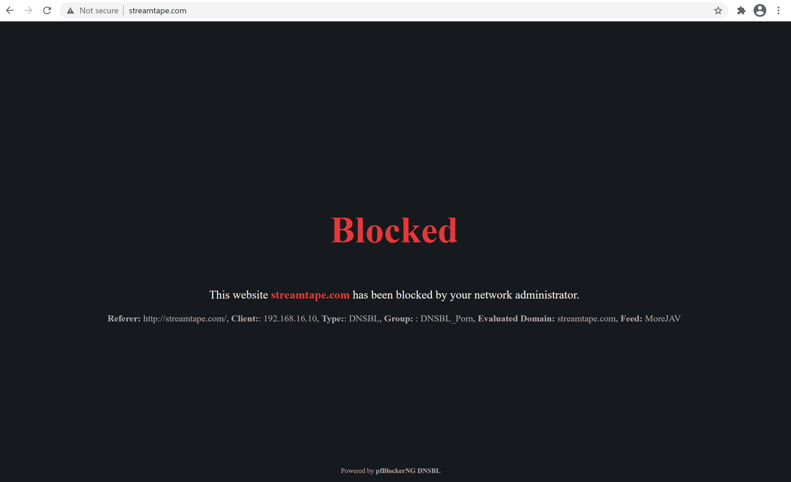
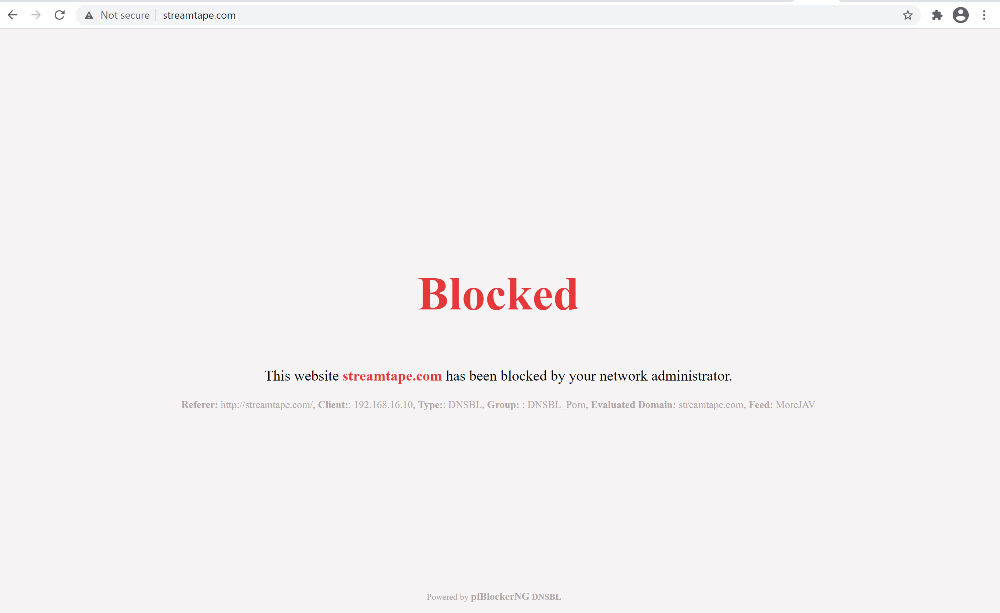
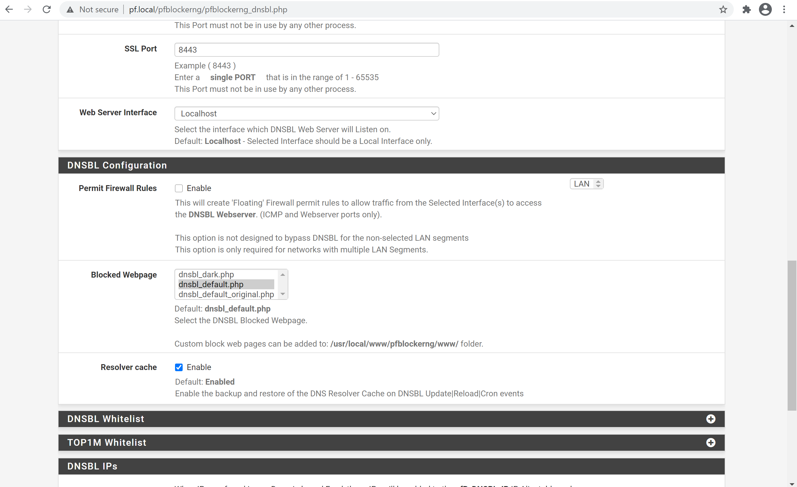

# dnsbl-custom

A customised DNSBL blocked page.

## Set up

1. Enable SSH on your device
2. Copy the .php files into `/usr/local/www/pfblockerng/www/` of the device's storage.
3. Go to the URL `<Router's IP/URL>/pfblockerng/pfblockerng/pfblockerng_dnsbl.php`(Firewall> pfBlockerNG> DNSBL? ) and select the php file of your choice in the DNSBL configuration.

# Screenshots

## Dark

## Light

## How To

